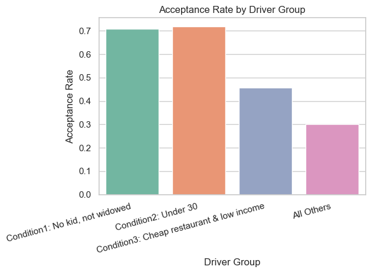
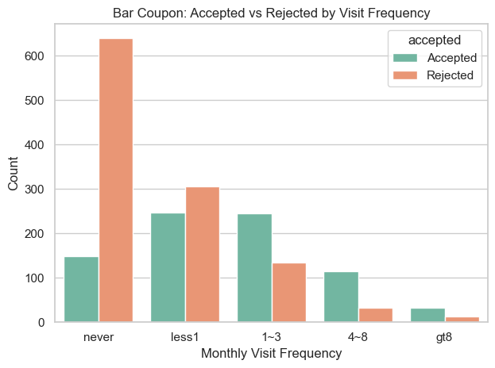
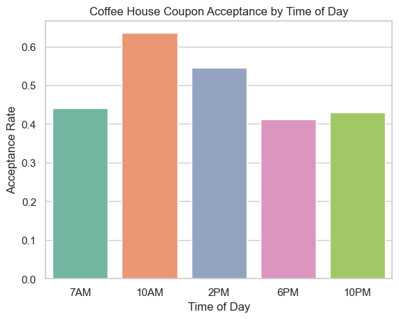
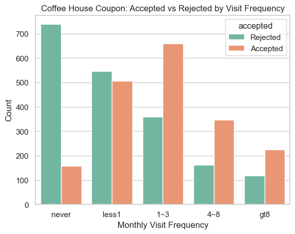

# Data Introduction

This data is from the UCI Machine Learning Repository and was collected via a survey on Amazon Mechanical Turk. The survey describes different driving scenarios, including 
- the destination, 
- current time, 
- weather, and 
- passenger, and then 
asks people whether they will accept the coupon if they are the driver.

There are five different types of coupons: 
1. less expensive restaurants (under $20), 
2. coffee houses, 
3. carry out & take away, 
4. bar, and 
5. more expensive restaurants ($20–$50).

Goal is to explore the data and utilize the matplotlib and seaborn libraries to create visualization

---

## Data Cleaning

- The `car` column was dropped
    - it had 12,576 missing values (99% of the data). What type of car they drive is not a critical factor to the core analysis, and populating 99% of the data would introduce bias than insight.
- Remaining columns with negligible missing values (`Bar`, `CoffeeHouse`, `CarryAway`, `RestaurantLessThan20`, `Restaurant20To50`) had their null rows dropped.
- The `age` column was converted from string (e.g. `below21`, `50plus`) to numeric values to enable age-based comparisons.

---

## Overall Findings

Proportion of drivers who chose to accept the coupon is **56.93%**.

---

## Bar Coupon Analysis

Proportion of bar coupon acceptance is **41.19%**.

- Acceptance rate (3 or fewer visits/month): **37.27%**
- Acceptance rate (more than 3 visits/month): **76.17%**
- Sample population over 25yrs and go to bar more than once a month: **68.98%** vs all others at **33.77%**
- Frequent bar goers without kids and from non-farming occupations: **70.94%** vs others at **29.79%**

### Hypothesis

Drivers who accept bar coupons tend to be frequent bar-goers; they visit more than once a month, are between 26yrs to 50yrs old, and are travelling without kids and are not widowed.

Frequent bar visits is the strongest predictor - those who go more than 3 times a month accept the coupons at 76% vs infrequent goers at 37%.

Social context is the second most important factor - drivers without kids and non-farming occupations accepted the coupons at 70.94% vs 29.79% for others.

Budget conscious drivers also show higher acceptance.

**Overall**, the ideal bar coupon recipient is a regular bar goer, travelling socially, without family obligations (like kids etc.).

### Next steps and recommendations

- **Avoid delivering to drivers with kids** - as they tend to reject the coupon
- **Target the frequent bar-goers** those who go more than 3 times a month accept the coupons at 76% vs infrequent goers at 37%.
- **Skip widowed drivers and framing/forestry** - as they show lower acceptance across all conditions

---

## Independent Investigation - Coffee House Coupons

### Introduction
What are the characteristics distinguish drivers who accept Coffee House coupons and the factors that influences their decision

Coffee house is the largest coupon group with 3,816 observations. The coffee house coupon acceptance rate is **49.63%** - two primary factors separate acceptors from non-acceptors: visit frequency and time of day.

- **Visit Frequency** - frequent coffee house visitors are more likely to accept a coffee house coupon. This conclusion is very similar to bar goers.

- **Time of Day** - acceptance peaks at 10AM, aligning with the morning coffee habit, and remains moderate at 2PM for afternoon coffee breaks. Evening hours (6PM, 10PM) show notably lower acceptance.

### Hypothesis

The overall acceptance rate for the coffee house coupon is 49.63% and primary factors are visit frequency and time of day.

- **Overall**, the ideal coffee house coupon recipient is a frequent coffee house visitor in the morning or early afternoon. Targeting infrequent visitors or evening drivers is less likely to yield better results.

### Next step and recommendations

- Target the frequent visitors - as they'll likely to accept the coupons than non-visitors
- Time the coupon delivery - send when the driver is most receptive like 10am or 2pm

